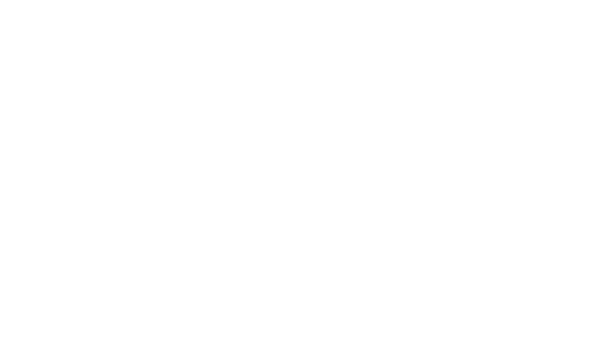

<p align="center">
  
</p>

<h1 align="center">Vitta</h1>

<p align="center">
  <strong>Vitta, sincronizando cuidado com a vida.</strong>
</p>

<p align="center">
  
  
  
  
  
  
</p>

O **Vitta** é um projeto de TCC desenvolvido por alunos do curso Técnico em Desenvolvimento de Sistemas da **ETEC Dr. Júlio Cardoso**, em Franca-SP.

A proposta do projeto é facilitar o acompanhamento da vacinação por meio de uma plataforma digital composta por um **aplicativo mobile** e um **Painel Web**, permitindo organizar registros vacinais, acompanhar doses e integrar usuários e profissionais de saúde.

---

## Sobre o projeto

O Vitta foi desenvolvido a partir da identificação de dificuldades relacionadas ao acompanhamento da vacinação, como:

- perda ou dificuldade de acesso à caderneta física;
- esquecimento de doses;
- dificuldade para consultar o histórico vacinal;
- desinformação sobre imunização;
- necessidade de acompanhamento de dependentes.

A solução reúne informações vacinais em um ambiente digital integrado, com foco inicial na população de **Franca-SP**.

---

## Principais funcionalidades

### Aplicativo Mobile

- Carteira de vacinação digital
- Histórico vacinal
- Próximas doses e doses atrasadas
- Central de notificações
- Gerenciamento de dependentes
- Catálogo de vacinas
- Conteúdos educativos
- Notícias relacionadas à vacinação
- Consulta de detalhes das aplicações
- Exportação da carteira em PDF

### Painel Web

- Gerenciamento de pacientes
- Cadastro e gerenciamento de vacinas
- Registro de aplicações
- Histórico de aplicações
- Consulta das carteiras dos pacientes
- Dashboard com visão geral
- Relatórios
- Controle de acesso para profissionais

---

## Site oficial

O site oficial do Vitta apresenta o projeto, suas principais funcionalidades e disponibiliza acesso às plataformas e materiais relacionados ao TCC.

### Acesse

- **Site oficial:** https://vitta-site-oficial.vercel.app
- **Painel Web:** https://vittaweb-production.up.railway.app/
- **Instagram:** https://www.instagram.com/vitta.tcc/
- **Download do aplicativo:** https://github.com/JMarcos212/vitta-site-oficial/releases/latest/download/vitta.apk

---

## Tecnologias utilizadas no site

- HTML5
- CSS3
- JavaScript
- Bootstrap 5
- Vercel
- GitHub

---

## Estrutura do projeto

```text
vitta-site-oficial/
│
├── index.html
├── css/
│   └── style.css
├── js/
│   └── script.js
├── assets/
│   ├── fonts/
│   ├── images/
│   │   ├── logo/
│   │   ├── mobile/
│   │   ├── painel/
│   │   └── equipe/
│   ├── videos/
│   └── vendor/
├── downloads/
│   └── Artigo_Cientifico_Vitta.pdf
└── README.md
```

---

## Deploy

O site é hospedado pela **Vercel** e possui deploy automático integrado ao GitHub.

Sempre que uma alteração é enviada para a branch principal:

```bash
git add .
git commit -m "Descrição da alteração"
git push
```

a Vercel realiza automaticamente um novo deploy da versão atualizada do site.

---

## Aplicativo

O APK do Vitta é disponibilizado por meio do **GitHub Releases**.

O endereço abaixo sempre direciona para a versão mais recente disponível:

```text
https://github.com/JMarcos212/vitta-site-oficial/releases/latest/download/vitta.apk
```

---

## Artigo científico

O projeto também conta com um artigo científico intitulado:

**Problemas da vacinação no Brasil: as dificuldades que geram o abandono vacinal**

O trabalho apresenta o contexto da queda da cobertura vacinal, os desafios encontrados e o desenvolvimento do Vitta como proposta tecnológica de apoio ao acompanhamento da imunização.

O artigo está disponível no próprio site.

---

## Equipe

O Vitta foi desenvolvido por:

- Davi Tavares
- Eduardo Carvalho
- Gabrielly Martins
- Heitor Testi
- João Marcos Peixoto

**Curso:** Técnico em Desenvolvimento de Sistemas  
**Instituição:** ETEC Dr. Júlio Cardoso  
**Cidade:** Franca-SP  
**Ano:** 2026

---

## Contato

**E-mail:** vitta.grupotcc@gmail.com  
**Instagram:** https://www.instagram.com/vitta.tcc/

---

## Observação

O Vitta é um projeto acadêmico desenvolvido como Trabalho de Conclusão de Curso.

---

<p align="center">
  <strong>Vitta, sincronizando cuidado com a vida.</strong>
</p>
